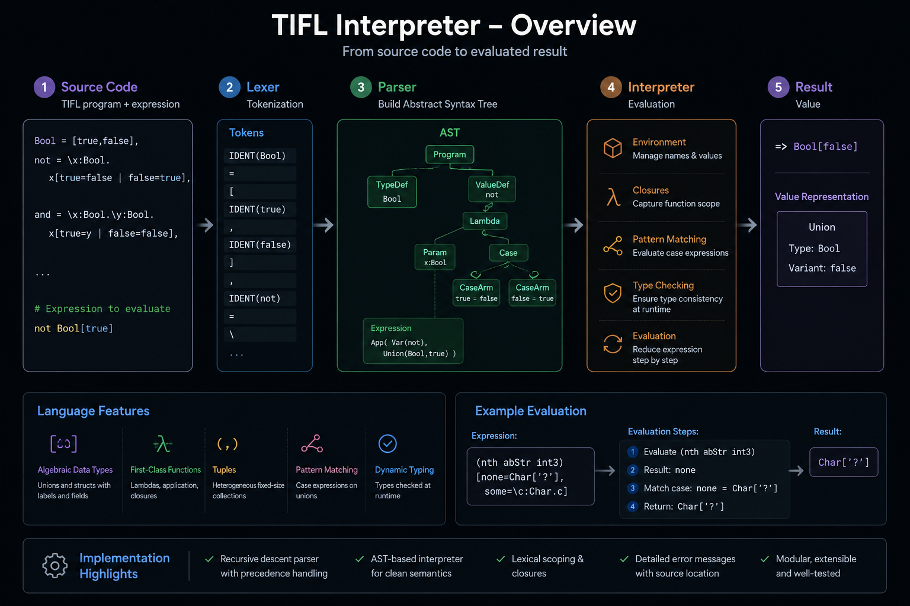

# TIFL Interpreter in Rust


Interpreter and type checker for the Typed Interpreted Functional Language (TIFL) written in Rust.

The project explores lexical analysis, parsing, abstract syntax trees (ASTs), type checking, and runtime evaluation through a modular interpreter architecture inspired by programming-language implementation concepts.



---

## Features

- Lexer / tokenizer
- Recursive-descent parser
- Abstract syntax tree generation
- Static type checking
- Runtime evaluation
- Scope and environment handling
- Functional language concepts
- Error reporting

---

## Technical Concepts Explored

- Programming language implementation
- Parsing & tokenization
- Abstract syntax trees (AST)
- Type systems
- Static analysis
- Runtime environments
- Expression evaluation
- Rust ownership and memory safety

---

## Repository Structure

| File | Description |
|---|---|
| `lexer.rs` | Lexical analysis and tokenization |
| `parser.rs` | Parser implementation |
| `ast.rs` | Abstract syntax tree definitions |
| `typecheck.rs` | Static type checker |
| `eval.rs` | Runtime evaluation engine |
| `env.rs` | Scope and environment handling |
| `types.rs` | Type system representation |
| `error.rs` | Error handling and diagnostics |
| `main.rs` | Entry point |

---

## Example Pipeline

```txt
Source Code
    ↓
Lexer
    ↓
Tokens
    ↓
Parser
    ↓
AST
    ↓
Type Checker
    ↓
Evaluation
```

---

## Example Concepts

The interpreter supports experimentation with:

- typed expressions
- variable bindings
- scope resolution
- semantic analysis
- runtime execution
- syntax tree traversal

---

## Build

Requirements:
- Rust
- Cargo

Build:

```bash
cargo build --release
```

Run:

```bash
cargo run
```

---

## Educational Context

This project was developed as part of coursework related to type systems and programming-language implementation.

The goal was to better understand how interpreters and static type systems are designed and implemented internally.